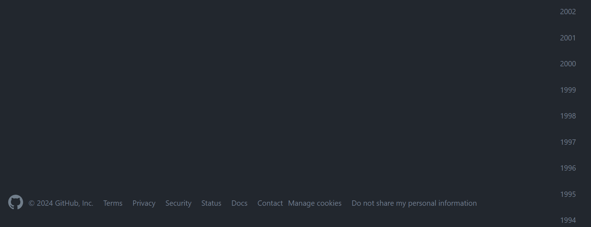
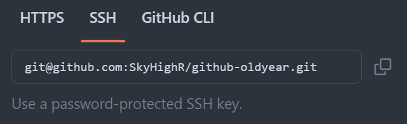

<h2 align=center> GitHub时光机 </h2>

 让咱们的GitHub历史回到任意年份   (设置的时候要大于或等于1970年哦) 

---

**Step 0:** [Create a new repo](https://github.com/new) on GitHub.

**Step 1:** Select your preferred authentication method

if you have SSH already setup locally, all you need is to copy your repo link and you're done :-)

Otherwise, if you chose HTTPS, you will need to [Generate a personal access token](https://github.com/settings/tokens/new) on GitHub and copypaste it.

Then enter you GitHub username and name of your new repository and you are done :)
